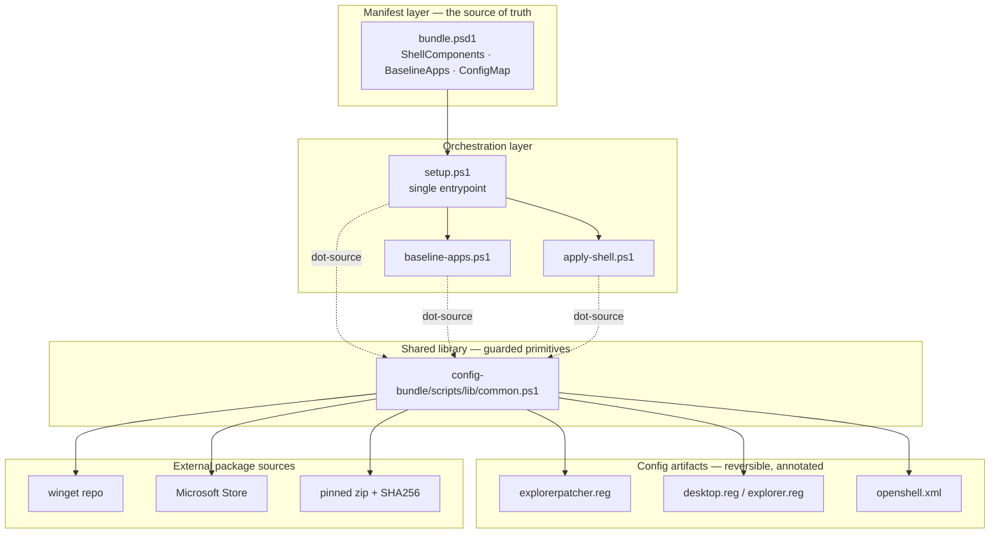
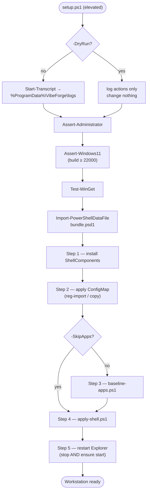
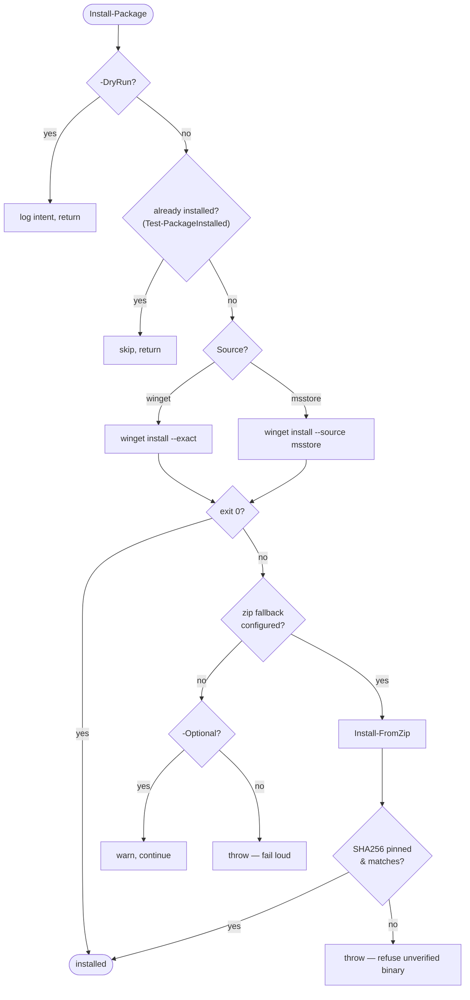
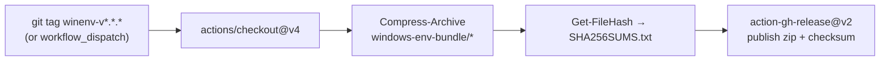

# ⚒️ Architecture — VibeForge Windows Environment Bundle

> **Working principle:** configs → scripts → orchestrator → pipeline.
> One manifest is the source of truth; generic scripts execute it; guarded
> primitives touch the machine; a release pipeline packages the whole thing.

This document is the map. It shows how the pieces fit, how a run flows, and
where external (untrusted) bytes enter so the guardrails are visible.

---

## 🧱 Layered component view

Everything is grouped by **concern**, not by tool. Editing the bundle means
editing the manifest — the layers below it stay generic.

---

## 🔁 Runtime flow (`setup.ps1`)

The orchestrator runs five steps behind three preflight guards. `-DryRun`
short-circuits every mutation; a transcript is written for every real run.

> Any step that throws is caught by the top-level `try/catch`, logged via
> `Write-Forge -Level Error`, and re-thrown so the run fails loud with the
> transcript intact.

---

## 📦 The install primitive (`Install-Package`)

Every package — shell component or baseline app — routes through one function
in `common.ps1`. It is idempotent, dry-run aware, source-routed, and refuses to
run an unverified binary.

---

## 🚚 Release pipeline

Lives at the **repo root** (`.github/workflows/`) because GitHub only runs
workflows from there. Versioned independently of the rest of the collection via
a scoped tag prefix.

---

## 🧩 `common.ps1` function reference

| Function                | Role                                                                 |
| ----------------------- | ------------------------------------------------------------------- |
| `Write-Forge`           | Branded, leveled logging (`>> VibeForge:`); feeds the transcript.    |
| `Assert-Administrator`  | Fail fast if not elevated (winget + HKLM writes need admin).         |
| `Assert-Windows11`      | Guard on build ≥ 22000; `-Force` overrides for VM/test images.       |
| `Test-WinGet`           | Verify winget exists; clear remediation if missing.                 |
| `Test-PackageInstalled` | Best-effort idempotency check via `winget list`.                    |
| `Install-Package`       | The one installer primitive (see decision flow above).              |
| `Install-FromZip`       | Pinned download + **mandatory** SHA256 verify + extract.            |
| `Import-RegFile`        | Guarded, logged, dry-run-aware `reg import`.                        |
| `Copy-BundleFile`       | Guarded copy that creates the destination tree.                    |
| `Expand-ForgePath`      | Expand `%ENV%` tokens used in manifest destinations.               |

---

## 🛡️ Trust boundary

External bytes enter at exactly three points — all in **L4**:

| Entry point       | What crosses the boundary        | Guardrail                                   |
| ----------------- | -------------------------------- | ------------------------------------------- |
| winget repo       | Signed package installs          | Exact-id match, `--exact`, exit-code check  |
| Microsoft Store   | TaskbarX (optional)              | `msstore` source, `-Optional` fail-soft     |
| pinned zip        | TaskbarX fallback binary         | **Mandatory SHA256**; refuses if unset/mismatch |

Cross-cutting guarantees: **idempotency** (safe re-runs), **`-DryRun`** (preview
without mutation), and a **transcript** (`%ProgramData%\VibeForge\logs\`) for
every real run — the audit trail.

---

*Part of the VibeForge [From the Forge](../../README.md) collection. Licensed
under the GNU Affero General Public License v3.0 — see [`LICENSE`](../../LICENSE).*
